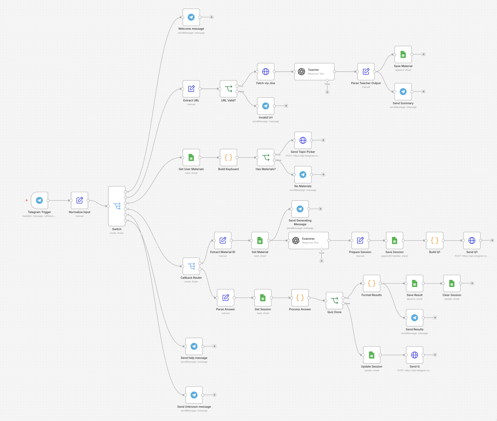

# Learning Assistant Bot — task 3

A Telegram bot that turns any article URL into a structured summary and a 5-question quiz. Built with n8n, OpenAI gpt-4o-mini, Jina Reader, and Google Sheets.

## Try it

Bot: [@mylearning_assistant2_bot](https://t.me/mylearning_assistant2_bot)

The workflow stays active during the challenge period — just message the bot.

## What it does

- `/start` — welcome message with the command list, personalized with your Telegram first name
- `/learn <url>` — fetches the article, summarizes it (title, difficulty, 5–7 key points, main concepts), and saves it to your library
- `/quiz` — lists your saved topics; pick one and take a 5-question multiple-choice quiz with scoring and explanations
- `/help` — shows the available commands
- Any other message — friendly hint pointing back to the commands

## How to use it — step by step

### 1. Start the bot

Open Telegram, search for **@mylearning_assistant2_bot**, send `/start`. You'll get a welcome message listing the commands.

### 2. Submit your first article

Send:

```
/learn https://en.wikipedia.org/wiki/Photosynthesis
```

After ~10 seconds the bot replies with:

- An inferred title
- A difficulty rating (beginner / intermediate / advanced)
- A short summary
- A list of main concepts
- 5–7 numbered key points

The article is saved to your personal library.

### 3. Add more articles

Repeat `/learn <url>` with any public URL — Wikipedia articles, blog posts, docs pages, news articles. Jina Reader handles content extraction.

### 4. Take a quiz

Send `/quiz`. The bot lists your saved topics as tappable buttons. Tap one.

A "🧠 Building your quiz on \<topic\>..." message appears immediately, then ~10 seconds later Q1 arrives. Each question shows:

- The question number (`Question 1/5`)
- The question text
- Options A through D in the message body (so long text never gets truncated)
- Four compact `A` / `B` / `C` / `D` buttons below

Tap a letter to answer. The next question appears within a second or two. After Q5 you get a results summary:

- Final score as a percentage
- A ✅ or ❌ next to each question
- Explanations only for the ones you got wrong

### 5. Retake or pick a different topic

Send `/quiz` again. Questions are regenerated fresh each time by the Examiner, so retaking the same topic gives you new questions.

## Persistence

Materials persist indefinitely. Close Telegram, come back a week later, send `/quiz` — your saved topics are still there. Per-user, by Telegram chat ID.

## Repository contents

- `workflow.json` — the exported n8n workflow (38 nodes)
- `workflow.png` - the exported n8n workflow schema
- `README.md` — this file
- `report.md` — development notes, decisions, what worked and what didn't

## Workflow


## Running it yourself

1. Sign up for n8n Cloud (free trial includes GPT credits).
2. Import `workflow.json` (Workflows → ⋯ → Import from File).
3. Set up three credentials:
   - **Telegram API** — bot token from [@BotFather](https://t.me/BotFather)
   - **Google Sheets OAuth2** — your Google account
   - **OpenAI** — API key with access to `gpt-4o-mini`
4. Create a Google Sheet named `LearningBot` with three tabs:
   - `materials` — columns: `id, chatId, url, title, content, summary, keyPoints, mainConcepts, difficulty, addedDate`
   - `sessions` — columns: `chatId, materialId, questions, currentQ, answers`
   - `results` — columns: `chatId, materialId, score, completedDate`
5. In every Google Sheets node, point to your sheet.
6. In BotFather, set the command menu:
   ```
   start - Welcome message
   learn - Submit a URL to learn from
   quiz - Take a quiz on saved material
   help - Show available commands
   ```
7. Activate the workflow (top-right toggle).
8. Message your bot.
